# Lattice
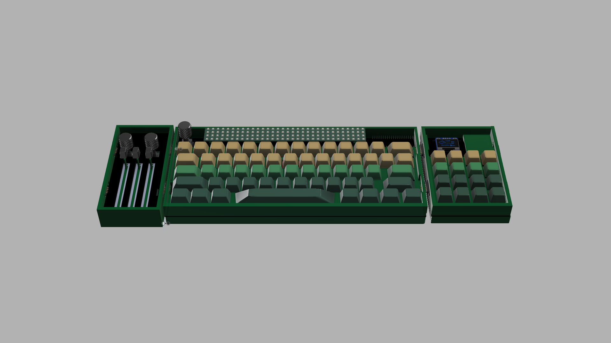
> a 60% mechanical keyboard with magnetically attached modules

# what even is Lattice?
Lattice is a modular 60% mechanical keyboard, with the main keyboard featuring:
- cherry mx black switches
- a raspberry pi pico 2
- an EC11 encoder
- 6 expansion ports(two 2.54 inch female headers and 4 4 pin magnetic pogo connectors)
- absolutely NO RGB(in the keyboard itself skdsks)

Lattice also comes with three modules(as of now), which are:
- a 16 key macropad with an OLED
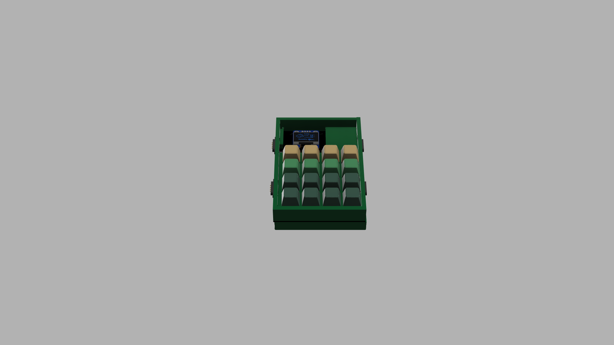
- a 3 slider, two encoder module i'm calling the sliderpad
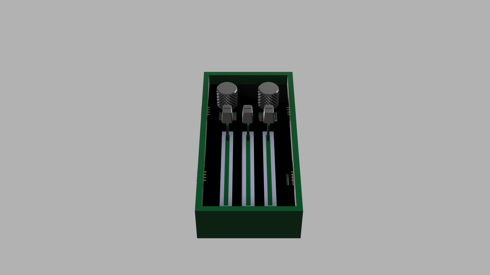
- a 32x4 RGB LED(specifically the WS2812B-2020) matrix that slides in the empty top bit of the keyboard(connected by 2.54 mm pins because I didnt trust the current limits of the magnetic connectors)
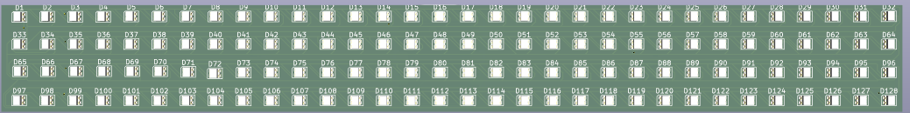

Each module features a xiao rp2040 to run everything else on it because its so smol and cute :3 

The macropad and the sliderpad connect with magnetic pogo pins and use I2C to communicate with the main board, while the matrix does the same thing but just connects with normal pin headers and sockets.  

# why did you even build this?(and many other whys)
I lowkenuinely just needed a keyboard pretty desperately - i've been using my crusty musty dusty redragon k552 for almost 5 years now and I need to switch it out :cryin:
additionally, I wanted a keyboard that I could actually take places, so things like a detachable cable(made possible by the pico 2) and a small form factor without compromising on key count was pretty important to me(hence the modules)

**Q: why xiao rp2040s on each board????** 
A: I can get them for hella cheap, they're really well documented, i've worked with them before and they're really small(works well for my purposes)

**Q: why not integrate a microcontroller on your board** 
A: while I would love to not use a module and put the straight microcontroller on this board, money is a problem here and I want to try and minimize costs where I can - a PCBA costs a crazy amount of money and with customs and shipping, this project aint covering it :cryin:

**Q: why not RGB?? are you not gamer???** 
A: i dont like RGB on the keeb - its annoying to work with, solder and must I remind you - **expensive** - to satiate the thirst for RGB i'm instead just slapping a giant matrix on the top empty bit of the board(hopefully playing snek on it soon)

# images

 Schematics 

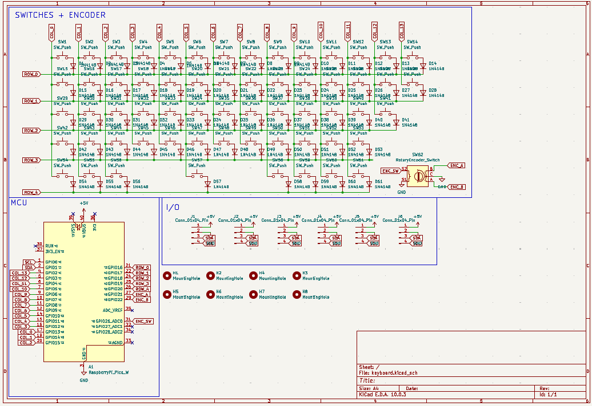
> main keyboard

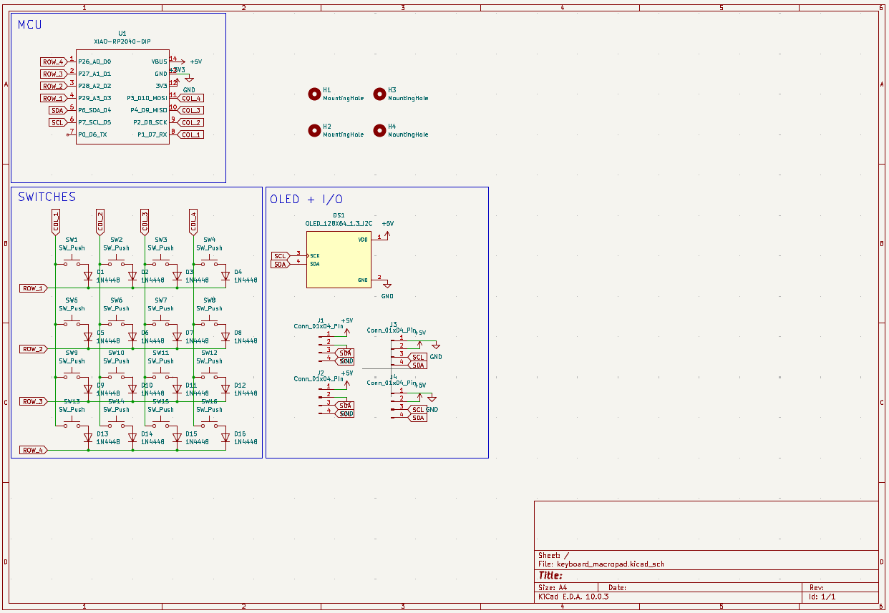
>macropad 

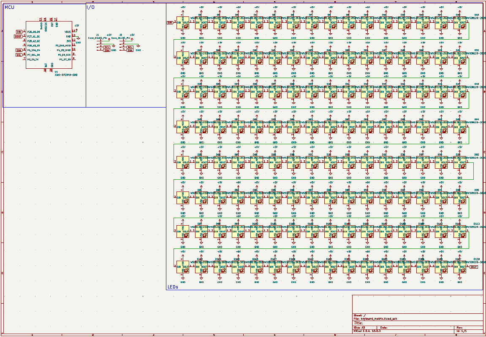
> sliderpad

> matrix

 PCBs 

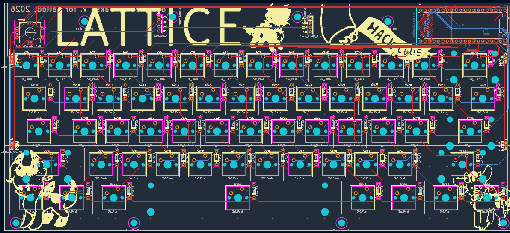
> main keyboard

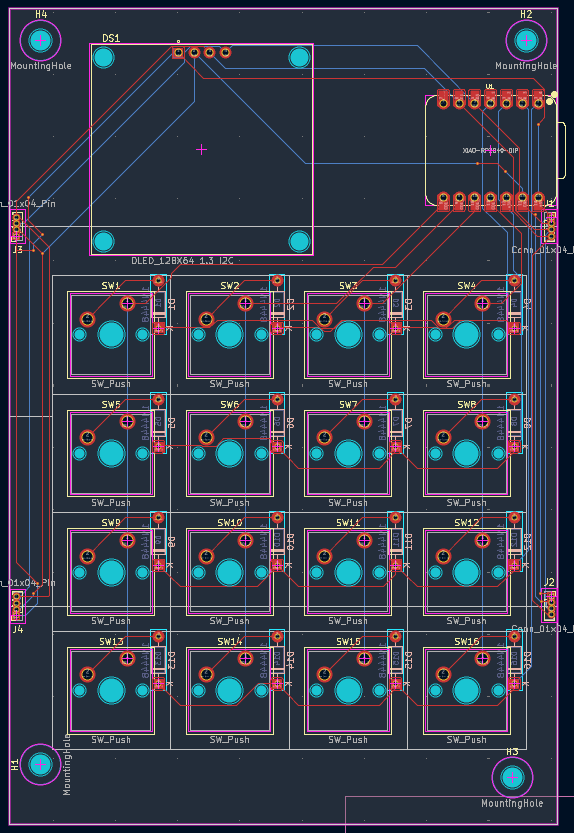
> macropad

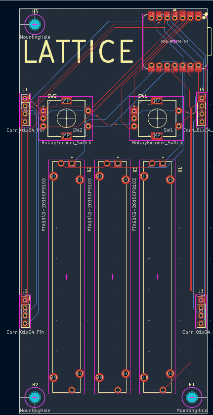
> sliderpad

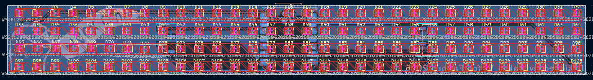
> LED matrix

 3D models 

> main keyboard

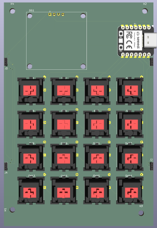
> macropad

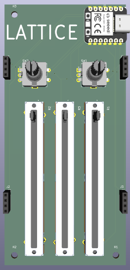
> sliderpad

> LED matrix

 CAD renders 

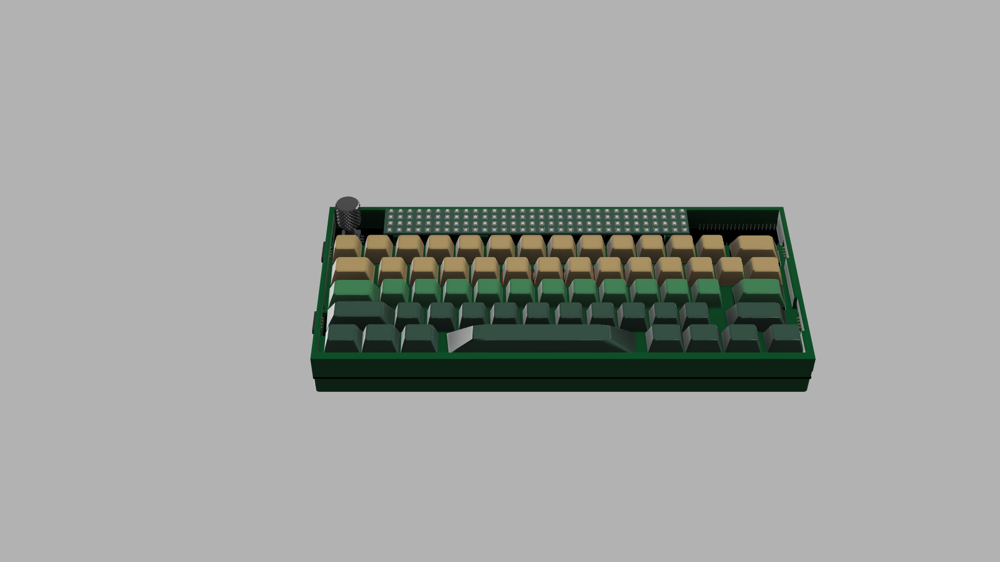
> main keyboard

> macropad

> sliderpad

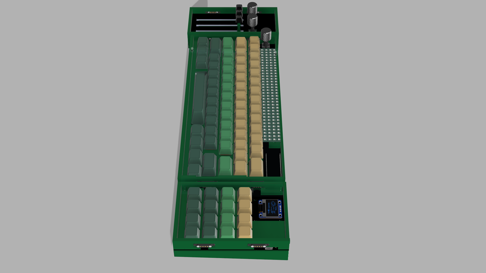
> the assembled keyboard!

# Zine

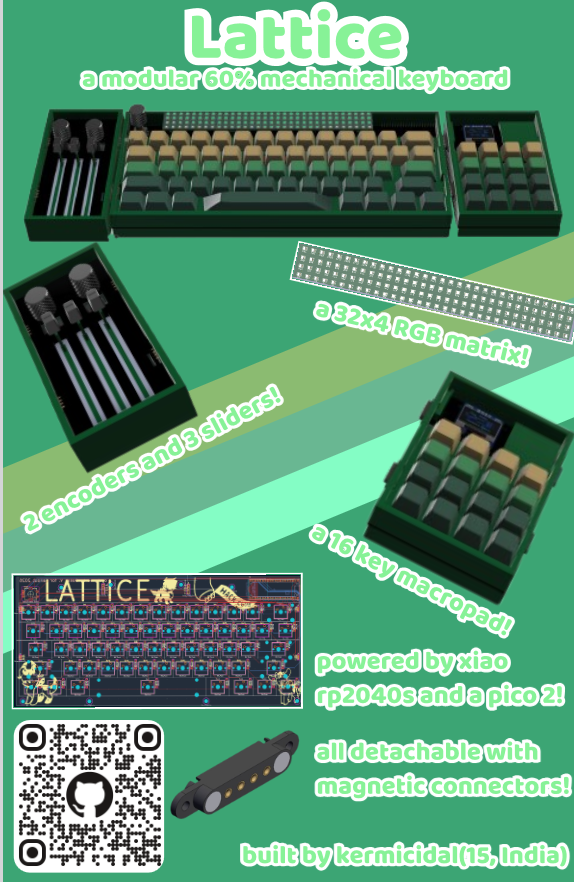

# BOM

| ITEM                     | LINK                                                                                                                                                                                                                                                                                                                                                                                                                                                                                                                                                                                                                                                                                                                                                                                                                                                                                                                                                                                                                                                                                                                                                                             | UNIT PRICE | QTY  | TOTAL PRICE | RUNNING TOTAL | NOTES                                                            |
| ------------------------ | -------------------------------------------------------------------------------------------------------------------------------------------------------------------------------------------------------------------------------------------------------------------------------------------------------------------------------------------------------------------------------------------------------------------------------------------------------------------------------------------------------------------------------------------------------------------------------------------------------------------------------------------------------------------------------------------------------------------------------------------------------------------------------------------------------------------------------------------------------------------------------------------------------------------------------------------------------------------------------------------------------------------------------------------------------------------------------------------------------------------------------------------------------------------------------- | ---------- | ---- | ----------- | ------------- | ---------------------------------------------------------------- |
| Cherry MX Black Switches | [https://neomacro.in/products/cherry-mx-switches](https://neomacro.in/products/cherry-mx-switches)                                                                                                                                                                                                                                                                                                                                                                                                                                                                                                                                                                                                                                                                                                                                                                                                                                                                                                                                                                                                                                                                               | 3.51       | 8    | 28.08       | 28.08         | pack of 10                                                       |
| Keycap Set               | [https://meckeys.com/shop/accessories/keyboard-accessories/keycaps/white-grey-keycaps/](https://meckeys.com/shop/accessories/keyboard-accessories/keycaps/white-grey-keycaps/)                                                                                                                                                                                                                                                                                                                                                                                                                                                                                                                                                                                                                                                                                                                                                                                                                                                                                                                                                                                                   | 10.49      | 1    | 10.49       | 38.57         | for keyboard                                                     |
| Blank Keycaps            | [https://meckeys.com/shop/accessories/keyboard-accessories/keycaps/blank/blank-dsa-keycaps-1u/](https://meckeys.com/shop/accessories/keyboard-accessories/keycaps/blank/blank-dsa-keycaps-1u/)                                                                                                                                                                                                                                                                                                                                                                                                                                                                                                                                                                                                                                                                                                                                                                                                                                                                                                                                                                                   | 1.05       | 4    | 4.2         | 42.77         | for macropad, will re-use hackpad keycaps                        |
| EC11 Encoders            | [https://www.amazon.in/CentIoT-Encoder-Digital-Potentiometer-Control/dp/B0888RWNM1?crid=243T1VPT812XT&dib=eyJ2IjoiMSJ9.cvB_S8-clwOY-fsh1jDEgdcKAdzY4Nv9KcBVsP_XLVRbEQ6v9pWSfdi6pitVyRPy5_iq-LYSO24WXsw22WOUBHiEFeP9N0__QSmFXXcr_OLQtUAA2f_e3-WLJc0WOyvXtuYeXFVcwnZSIHdgY8HUAiBYdGh2xdjBK8FlsXImh0q4vkDoK-QkVKE3ac8hCBKdF6XJ_k65GqGC4-3qzPH49GIBedFxUU8WMVSal15O1mF876LbmOvkPvdrdTHcJmVf7XgMnL2mbmJ7N0VyJ4bqivJS2Slw9SVVXHW7uuvRr1E.vdIwwapIw50QxzlGlNGifWW_KbD3sPBQ2U9RfnQ-5LE&dib_tag=se&keywords=EC11+encoder&qid=1780688877&s=industrial&sprefix=ec11+enco%2Cindustrial%2C291&sr=1-1](https://www.amazon.in/CentIoT-Encoder-Digital-Potentiometer-Control/dp/B0888RWNM1?crid=243T1VPT812XT&dib=eyJ2IjoiMSJ9.cvB_S8-clwOY-fsh1jDEgdcKAdzY4Nv9KcBVsP_XLVRbEQ6v9pWSfdi6pitVyRPy5_iq-LYSO24WXsw22WOUBHiEFeP9N0__QSmFXXcr_OLQtUAA2f_e3-WLJc0WOyvXtuYeXFVcwnZSIHdgY8HUAiBYdGh2xdjBK8FlsXImh0q4vkDoK-QkVKE3ac8hCBKdF6XJ_k65GqGC4-3qzPH49GIBedFxUU8WMVSal15O1mF876LbmOvkPvdrdTHcJmVf7XgMnL2mbmJ7N0VyJ4bqivJS2Slw9SVVXHW7uuvRr1E.vdIwwapIw50QxzlGlNGifWW_KbD3sPBQ2U9RfnQ-5LE&dib_tag=se&keywords=EC11+encoder&qid=1780688877&s=industrial&sprefix=ec11+enco%2Cindustrial%2C291&sr=1-1) | 1.8        | 3    | 5.4         | 48.17         | already have                                                     |
| Slide Potentiometers     | [https://www.amazon.in/Electronic-Spices-SC6080GH-Channel-Potentiometer/dp/B0BGY5C2KV?th=1](https://www.amazon.in/Electronic-Spices-SC6080GH-Channel-Potentiometer/dp/B0BGY5C2KV?th=1)                                                                                                                                                                                                                                                                                                                                                                                                                                                                                                                                                                                                                                                                                                                                                                                                                                                                                                                                                                                           | 3          | 1.68 | 5.04        | 53.21         | amazon is unfortunately the cheapest and most reliable place >:( |
| OLED                     | [https://robu.in/product/0-96-inch-i2c-iic-oled-lcd-module-4pin-with-vcc-gnd-blue/](https://robu.in/product/0-96-inch-i2c-iic-oled-lcd-module-4pin-with-vcc-gnd-blue/)                                                                                                                                                                                                                                                                                                                                                                                                                                                                                                                                                                                                                                                                                                                                                                                                                                                                                                                                                                                                           | 2.14       | 1    | 2.14        | 55.35         | already have                                                     |
| 1N4148 diodes            | [https://robu.in/product/1n4148-1w-zener-diode-pack-of-50/](https://robu.in/product/1n4148-1w-zener-diode-pack-of-50/)                                                                                                                                                                                                                                                                                                                                                                                                                                                                                                                                                                                                                                                                                                                                                                                                                                                                                                                                                                                                                                                           | 0.013      | 80   | 1.04        | 56.39         |                                                                  |
| PCB                      | JLCPCB                                                                                                                                                                                                                                                                                                                                                                                                                                                                                                                                                                                                                                                                                                                                                                                                                                                                                                                                                                                                                                                                                                                                                                           | 82.42      | 1    | 82.42       | 138.81        |                                                                  |
| Xiao RP2040              | [https://thinkrobotics.com/products/seeed-studio-xiao-rp2040?variant=47933480173885&country=IN&currency=INR&utm_medium=product_sync&utm_source=google&utm_content=sag_organic&utm_campaign=sag_organic](https://thinkrobotics.com/products/seeed-studio-xiao-rp2040?variant=47933480173885&country=IN&currency=INR&utm_medium=product_sync&utm_source=google&utm_content=sag_organic&utm_campaign=sag_organic)                                                                                                                                                                                                                                                                                                                                                                                                                                                                                                                                                                                                                                                                                                                                                                   | 5.77       | 3    | 17.31       | 156.12        | already have 2                                                   |
| Pico 2                   | [https://robu.in/product/raspberry-pi-pico-2/](https://robu.in/product/raspberry-pi-pico-2/)                                                                                                                                                                                                                                                                                                                                                                                                                                                                                                                                                                                                                                                                                                                                                                                                                                                                                                                                                                                                                                                                                     | 5.7        | 1    | 5.7         | 161.82        | already have 2                                                   |
| WS2812B                  | [https://hubtronics.in/ws2812b-2020](https://hubtronics.in/ws2812b-2020)                                                                                                                                                                                                                                                                                                                                                                                                                                                                                                                                                                                                                                                                                                                                                                                                                                                                                                                                                                                                                                                                                                         | 0.06       | 128  | 7.68        | 169.5         |                                                                  |
| TOTAL                    |                                                                                                                                                                                                                                                                                                                                                                                                                                                                                                                                                                                                                                                                                                                                                                                                                                                                                                                                                                                                                                                                                                                                                                                  |            |      | 0           | 169.5         |                                                                  |
|                          |                                                                                                                                                                                                                                                                                                                                                                                                                                                                                                                                                                                                                                                                                                                                                                                                                                                                                                                                                                                                                                                                                                                                                                                  |            |      |             |               |                                                                  |